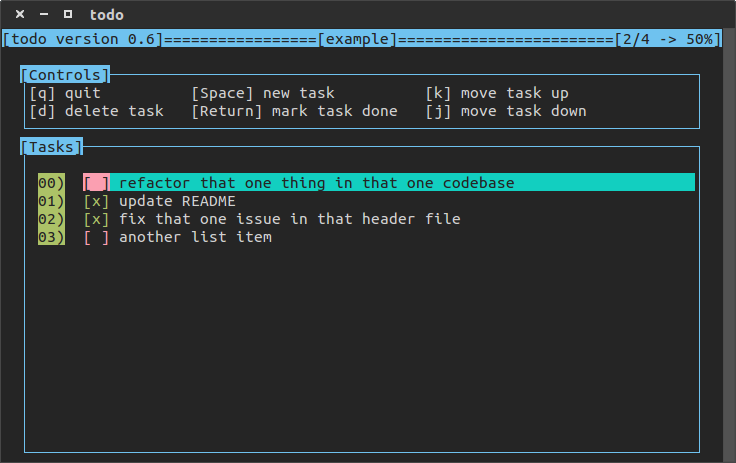

# todo 
A program for CLI to-do lists, written using `ncurses`!

todo running in gnome-terminal

# installation

Clone and run `make` to build. Run `todo` to launch the program. Requires `ncurses`. On debian-like systems, such as ubuntu, ncurses can be installed through `sudo apt-get install libncurses-dev`.

You can then run `make install` to copy the executable to `DEST_DIR`, 
which by default is `/usr/bin`.

If you wish to uninstall the application, run `make remove`

This program supports bash autocompletion through `completion/todoc`.
This file will be copied to `/usr/share/bash-completion/completions/` 
when `make install` is run, and can be removed with `make remove`.

# usage

The up and down arrow keys can be used to navigate through the list.

Use the space key to start creating a new task. Once the space key
has been pressed, a input window will appear, enter your text and
press return to finish. Hitting return without entering text
will cancel adding a new task, as will the escape key.

A Task can be edited by selecting it and hitting "E". This will display
the input box with the current task text prefilled. You can then modify it
as you see fit, and save it with the return key. If the escape key is
hit or you save an empty task, the task will not be edited.

The return key will toggle task completion, and the "D" key will
remove the selected task from the list.

The "S" key will sort the list, first by completeness 
then lexicographically. 

A divider can be added to the to-do list with the "Z" key. The divider can 
be given a name or left unnamed. Dividers are not counted in the completed
percentage in the title bar. When sorting, tasks separated by dividers will
be sorted independently. Dividers will never move after a sort.

Certain actions can be undone through the "U" key. Please note that this
is intended to recover from mistakes, not create a comprehensive history
of edits. Only one level of history is kept. Events that support undo are
deleting a task, editing a task, adding a task, and sorting the list.

The "K" and "J" keys will move the selected task up and down in the
list, respectively.

The "Q" key will exit the program.

If your terminal supports it, the mouse can also be used to interact
with the program. Left click will highlight the task under the
cursor, and right click will toggle the task under the cursor. The
mouse wheel can be used to scroll up and down in the list. Note that
mouse scrolling, particular down scrolling, is a bit finicky and may
not work with your terminal.

Todo lists are saved to `~/.todo`. By default, the list will be saved
any time it is edited. If you wish to disable this for some reason,
simply change `autoSave` to `false` in `config.hpp` and recompile.

# syntax

`todo [list name] [arguments]`

If no list name is provided, the default one will be used. This is "todo" unless you changed it.

# arguments

* -h, -help, --help -> prints usage and exits

* -version, --version -> prints version information and exits

* -d, --delete   -> delete the to-do list

* -l, --list     -> list all to-do lists and exit

* -n, --no-color -> disable colorized output

* -p, --print    -> print the to-do list to the console and exit

* -r, --rename   -> rename the to-do list

# configuration

Don't like how something works or looks? You can probably change it in `config.hpp`. Just change and rebuild. A real configuration file is a future goal.
